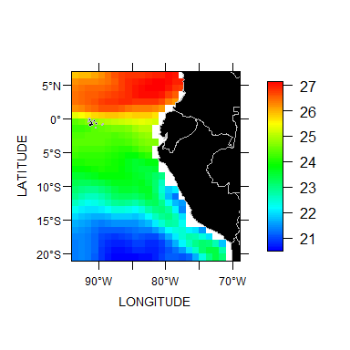

# Programación científica - tercer examen
Ricardo Oliveros-Ramos  
2 de julio de 2017  


## Instrucciones

Este repositorio debe ser clonado (_fork_) en su repositorio personal. El examen consiste en escribir un reporte modificando el archivo `examen.Rmd`. Todos los archivos que cree durante la resolución del examen deben ser incluidos en su versión del repositorio. Los datos que puede utilizar se encuentran en la carpeta `datos`. La descripción de los datos (i.e. dimensiones, unidades) se encuentra en la metadata del archivo netCDF.

Las preguntas científicas que responda en su informe son de libre elección. Puede realizar cualquier tipo de análisis y comparación a nivel espacial, temporal o ambos. No es necesario usar todos los datos y puede utilizar otros datos adicionales si lo considera apropiado. Cualquier otra fuente de datos que use debe ser incluida en la carpeta `datos`.

Esta permitido compartir código entre los participantes del curso en la medida que se usen las herramientas de _git_ para tal propósito. Hacerlo de esta forma será evaluado positivamente para todos los involucrados. Cualquier otra forma de compartir código no está permitida y influirá negativamente en la evaluación.

Su repositorio debe contener al menos 5 'commits'. Se evaluará la versión de su repositorio inmediatamente anterior a las 23:59:59 GMT-05 del domingo 9 de julio de 2017.

Puede encontrar una referencia a los principales comandos de rmarkdown [aquí](https://www.rstudio.com/wp-content/uploads/2016/03/rmarkdown-cheatsheet-2.0.pdf).

Para solicitar cualquier aclaración sobre el examen, cree un nuevo _issue_ ingresando [aquí](https://github.com/roliveros-ramos/C6118-UPCH/issues).

Se sugiere que instalen el paquete _kali_:


```r
install.packages("devtools")
devtools::install_github("roliveros-ramos/kali")
```


```r
library(ncdf4)
library(fields)
library(kali)
nc = nc_open("datos/sst.nc4")
sst = ncvar_get(nc, "to")
lat = ncvar_get(nc, "latitude")
lon = ncvar_get(nc, "longitude") - 360
image.map(lon, lat, sst[,,1])
```



